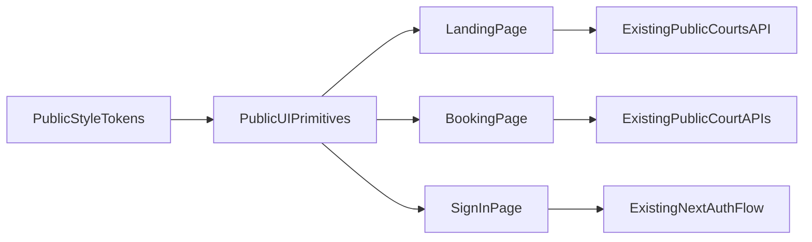

# Public UI/UX Redesign Plan (Phase 1)

## Scope Locked
- Pages in scope:
  - [C:/Users/Escanorrrrr/OneDrive/Desktop/Khaesey_Files/badminton-scbc/frontend/src/app/page.tsx](C:/Users/Escanorrrrr/OneDrive/Desktop/Khaesey_Files/badminton-scbc/frontend/src/app/page.tsx)
  - [C:/Users/Escanorrrrr/OneDrive/Desktop/Khaesey_Files/badminton-scbc/frontend/src/app/(public)/book/[slug]/page.tsx](C:/Users/Escanorrrrr/OneDrive/Desktop/Khaesey_Files/badminton-scbc/frontend/src/app/(public)/book/[slug]/page.tsx)
  - [C:/Users/Escanorrrrr/OneDrive/Desktop/Khaesey_Files/badminton-scbc/frontend/src/app/(auth)/auth/signin/page.tsx](C:/Users/Escanorrrrr/OneDrive/Desktop/Khaesey_Files/badminton-scbc/frontend/src/app/(auth)/auth/signin/page.tsx)
  - Public forms reused by regular users first (booking + related public form patterns), with the same backend/API calls.
- Explicitly out of scope for now: admin/superadmin pages and backend logic.

## Design Direction (Inspired Vibe)
- Keep your current layout flow, but modernize visual language across public pages:
  - Dark base + richer gradient surfaces
  - Softer neon-accent highlights
  - Consistent card/input/button radii, spacing, and elevation
  - Higher text contrast and clearer interaction states
- Preserve all existing behavior:
  - No route changes
  - No API payload changes
  - No validation/business-rule changes

## Architecture for DRY Public UI
- Introduce reusable public UI primitives under a new shared folder:
  - [C:/Users/Escanorrrrr/OneDrive/Desktop/Khaesey_Files/badminton-scbc/frontend/src/components/public/ui](C:/Users/Escanorrrrr/OneDrive/Desktop/Khaesey_Files/badminton-scbc/frontend/src/components/public/ui)
- Keep existing admin UI components untouched.
- Add a small public token layer in global styles to avoid hardcoded colors repeated per page:
  - [C:/Users/Escanorrrrr/OneDrive/Desktop/Khaesey_Files/badminton-scbc/frontend/src/app/styles/globals.css](C:/Users/Escanorrrrr/OneDrive/Desktop/Khaesey_Files/badminton-scbc/frontend/src/app/styles/globals.css)

## Implementation Steps
1. Create public design tokens and utility class conventions
- Extend [C:/Users/Escanorrrrr/OneDrive/Desktop/Khaesey_Files/badminton-scbc/frontend/src/app/styles/globals.css](C:/Users/Escanorrrrr/OneDrive/Desktop/Khaesey_Files/badminton-scbc/frontend/src/app/styles/globals.css) with tokenized public colors (bg, surface, text, muted, accent, borders).
- Normalize typography usage for public pages (consistent sans/mono pair and scale).
- Keep existing classes functional during migration to avoid breakage.

2. Build reusable public components (logic-agnostic)
- Add components in [C:/Users/Escanorrrrr/OneDrive/Desktop/Khaesey_Files/badminton-scbc/frontend/src/components/public/ui](C:/Users/Escanorrrrr/OneDrive/Desktop/Khaesey_Files/badminton-scbc/frontend/src/components/public/ui):
  - `PublicButton` (primary/secondary/ghost)
  - `PublicCard` (surface variants)
  - `PublicInput`, `PublicSelect`, `PublicTextarea`, `PublicField`
  - `PublicBadge` / `StatusChip`
  - `InlineNotice`
  - `PublicStepper` (for multi-step booking/form flow)
  - `KeyValueSummary`
- These will accept props for state (`selected`, `disabled`, `loading`) but contain no API logic.

3. Refactor booking page to consume primitives without touching flow logic
- Update [C:/Users/Escanorrrrr/OneDrive/Desktop/Khaesey_Files/badminton-scbc/frontend/src/app/(public)/book/[slug]/page.tsx](C:/Users/Escanorrrrr/OneDrive/Desktop/Khaesey_Files/badminton-scbc/frontend/src/app/(public)/book/[slug]/page.tsx):
  - Replace duplicated style blocks/classes with public primitives.
  - Keep `fetch` calls, step transitions, validation, and submit payload exactly as-is.
  - Ensure pricing display continues to use current computed values and court-specific settings.

4. Redesign landing page visuals using shared primitives
- Update [C:/Users/Escanorrrrr/OneDrive/Desktop/Khaesey_Files/badminton-scbc/frontend/src/app/page.tsx](C:/Users/Escanorrrrr/OneDrive/Desktop/Khaesey_Files/badminton-scbc/frontend/src/app/page.tsx):
  - Modernize hero/cards/CTAs/inputs to match the new token system.
  - Reuse same button/card/badge/input components to eliminate repeated class strings.
  - Preserve all existing search/filter/listing behavior.

5. Redesign sign-in page to match public system
- Update [C:/Users/Escanorrrrr/OneDrive/Desktop/Khaesey_Files/badminton-scbc/frontend/src/app/(auth)/auth/signin/page.tsx](C:/Users/Escanorrrrr/OneDrive/Desktop/Khaesey_Files/badminton-scbc/frontend/src/app/(auth)/auth/signin/page.tsx):
  - Apply same surface, spacing, and CTA components.
  - Keep NextAuth flow, redirects, and role behavior unchanged.

6. Verification and regression safety
- Run targeted checks for each page route and critical flows:
  - `/` load, search/filter interactions
  - `/book/[slug]` step progression + reservation submit
  - `/auth/signin` login trigger and error states
- Ensure no API contracts changed and no middleware/auth behavior changed.
- Run lint checks on modified files.

## Guardrails
- Do not edit backend files in this phase.
- Do not alter request/response schemas.
- Do not remove existing fallback styles until replacement is verified.
- Keep component extraction incremental to reduce UI regressions.

## Deliverables
- Unified modern public visual system with reusable components.
- Cleaner DRY public UI codebase (less duplicated class/style logic).
- No functional/backend regression in booking/auth/public browsing.